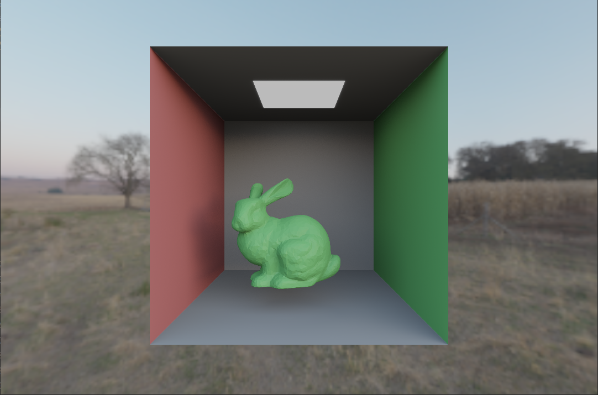
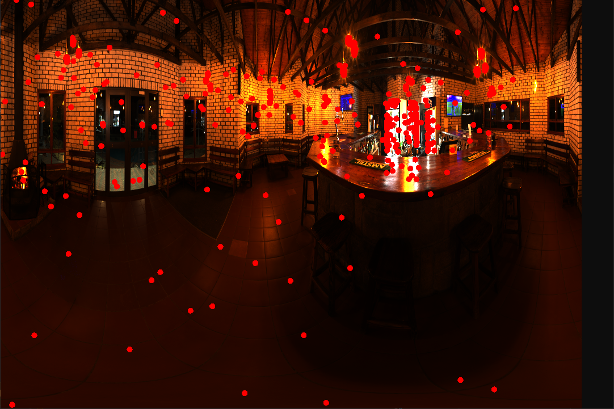
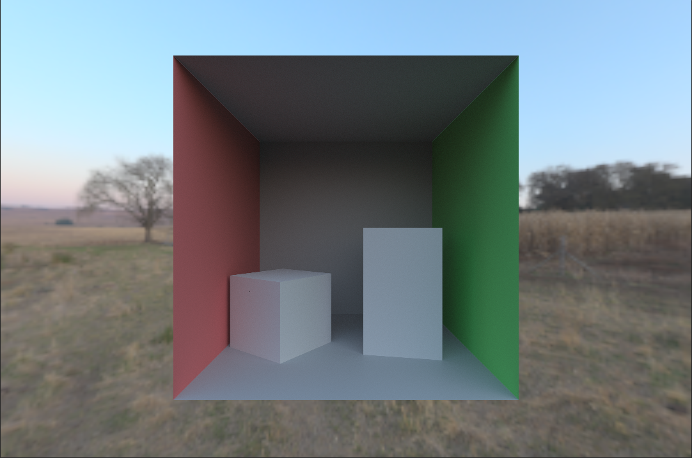
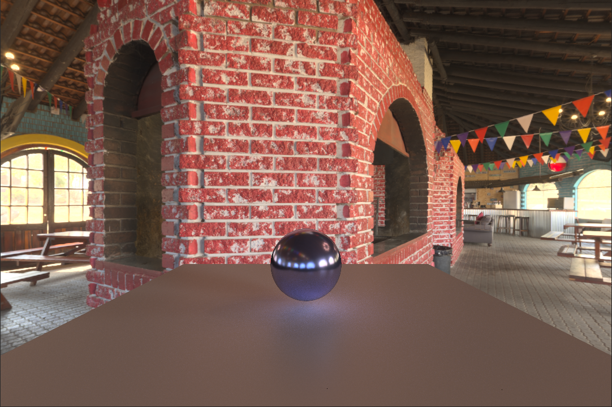
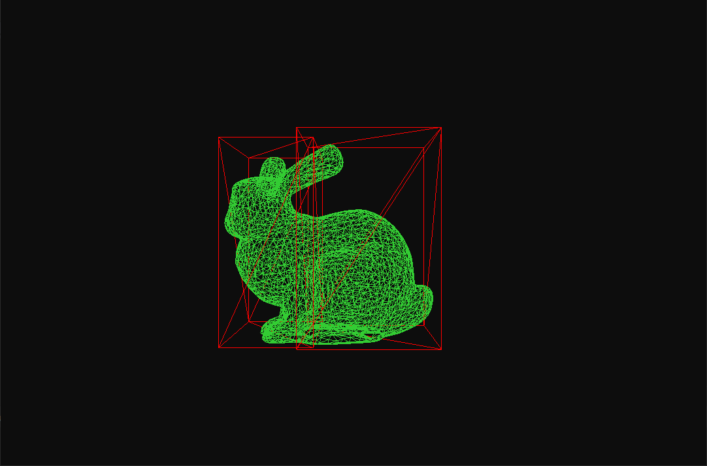

# 光追

1. forward 管线 √
2. test scene √
3. bvh √
4. raytracing 管线 √
5. disney pbr √
6. sobol sequence √
7. importance sample √
8. 可视化
9. 正确性验证
10. 其他加速结构 & 算法优化
11. imgui
12. 更多测试场景
13. compute shader

## output

路径追踪

伽马矫正

Disney BRDF

4000 sp

可视化

## 参考

https://github.com/AKGWSB/EzRT?tab=readme-ov-file

重要性采样  https://zhuanlan.zhihu.com/p/360420413