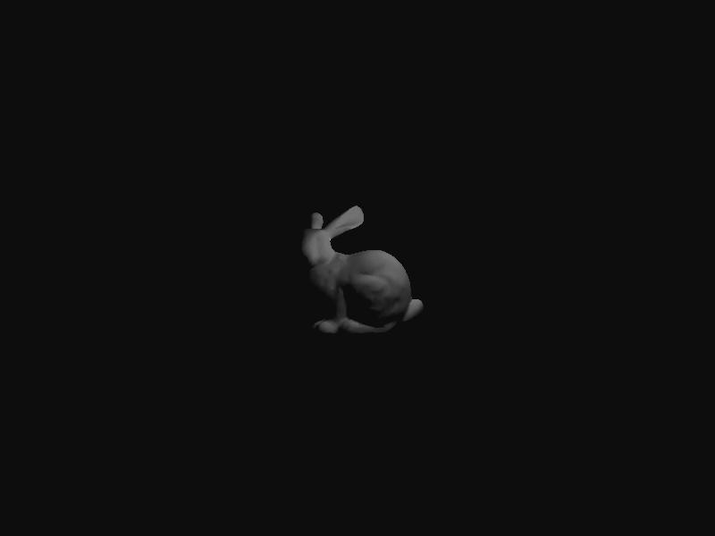
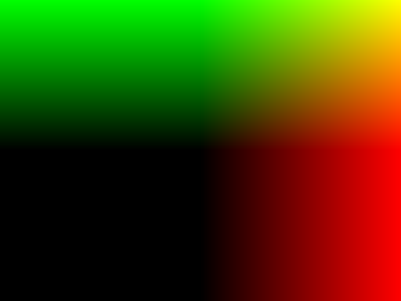
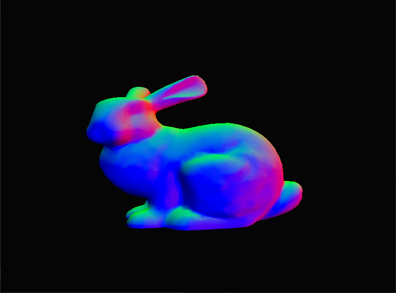
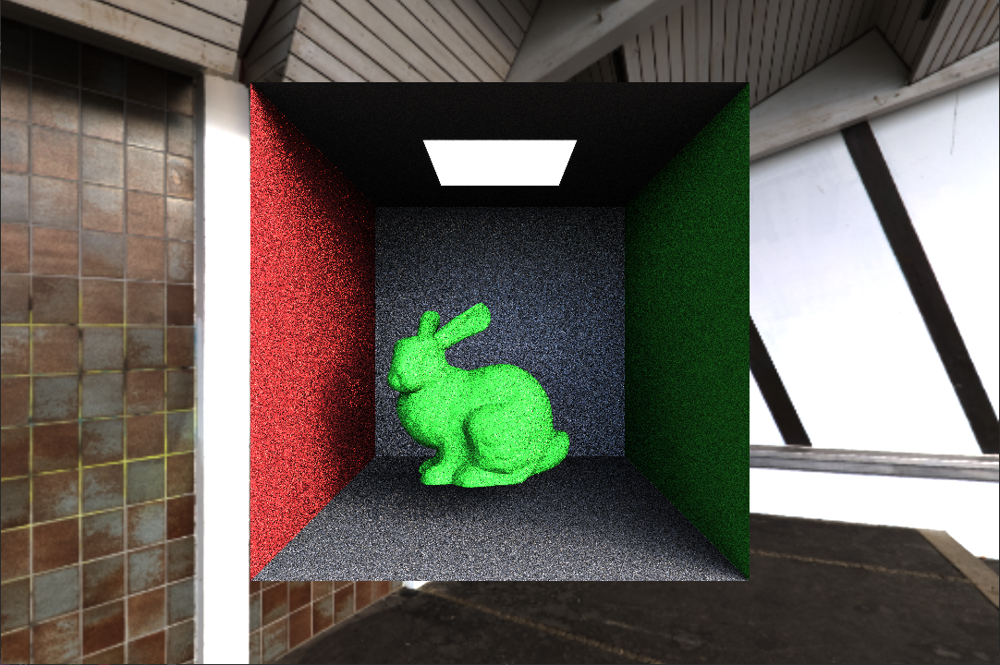
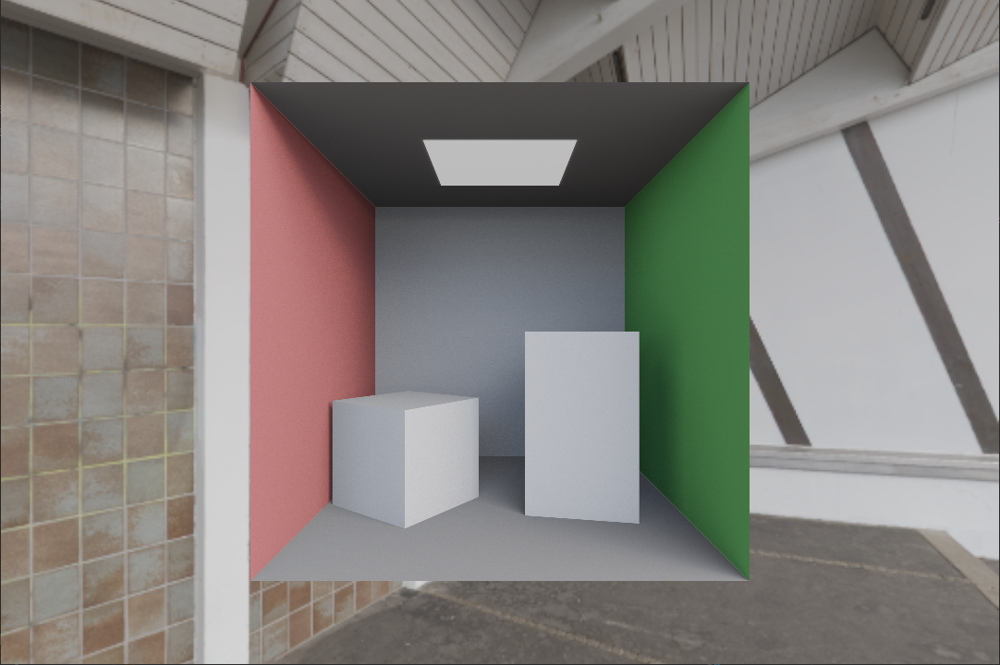

# 光追

重要性采样  https://zhuanlan.zhihu.com/p/360420413

根据对结果的贡献进行采样，重要性采样的目的就是获取贡献更大的点

怎么获取呢，逆函数发获取

漫反射 IA 可以直接均匀采样拟合

## 结构

路径追踪

伽马矫正

Disney BRDF

## 参考

https://github.com/AKGWSB/EzRT?tab=readme-ov-file