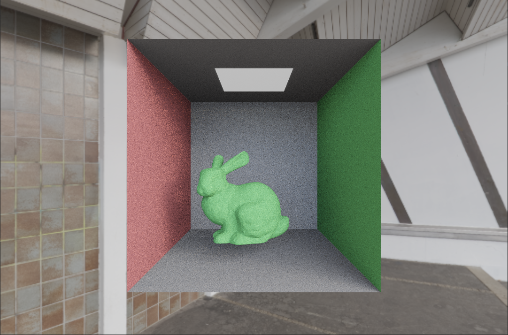
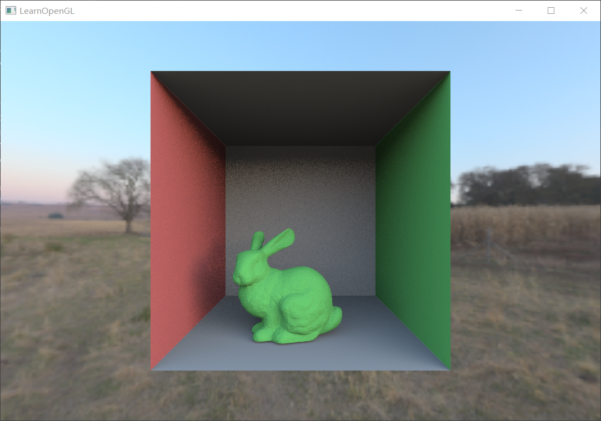
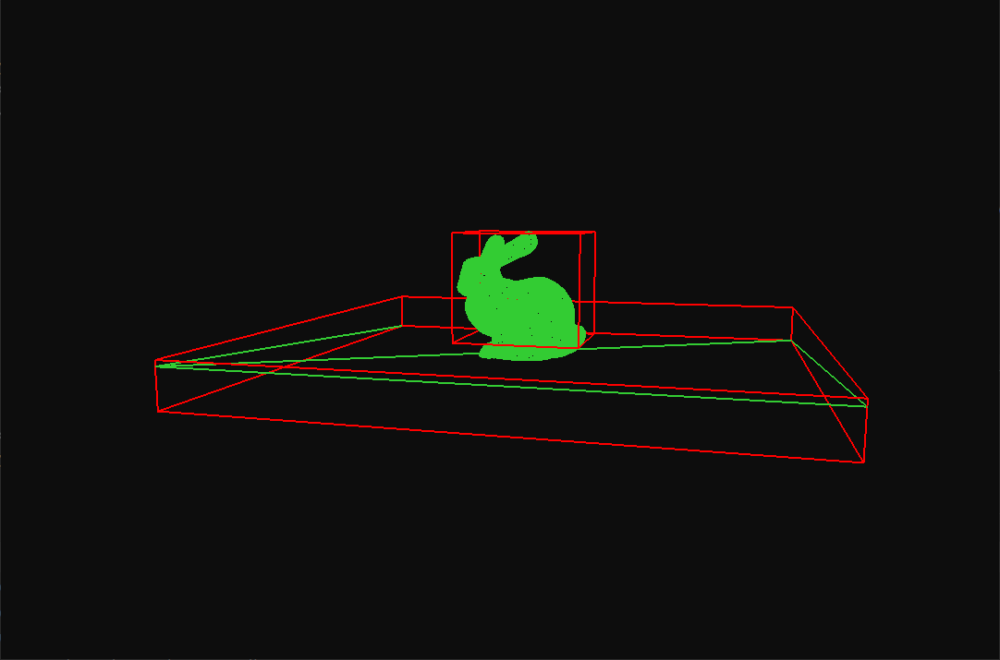
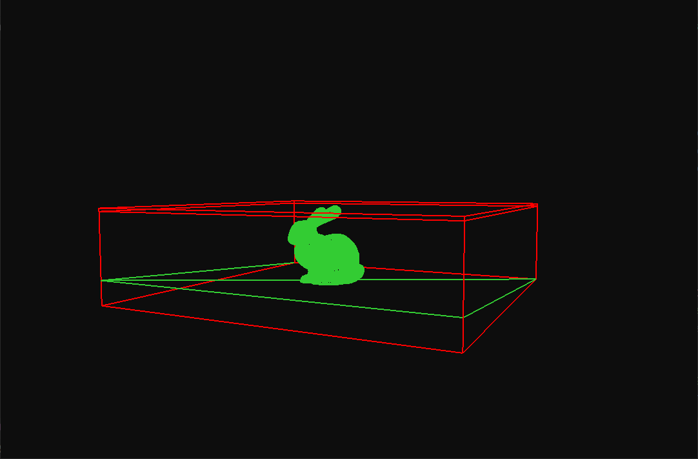
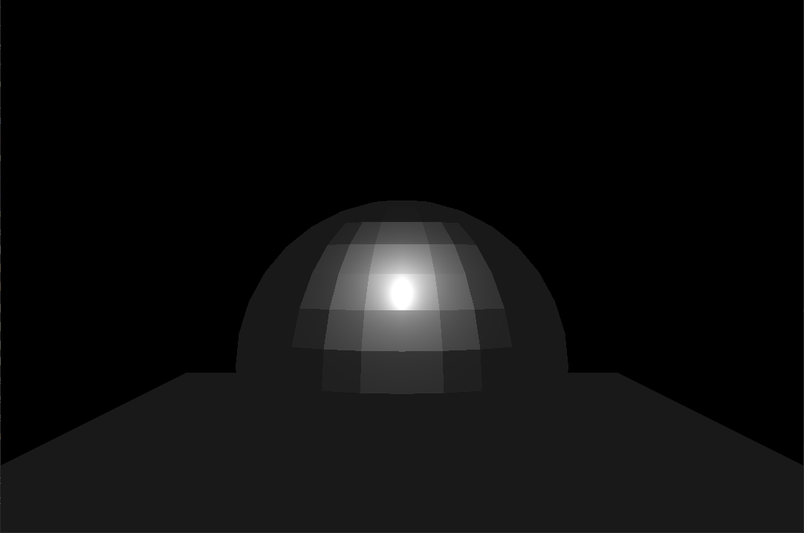
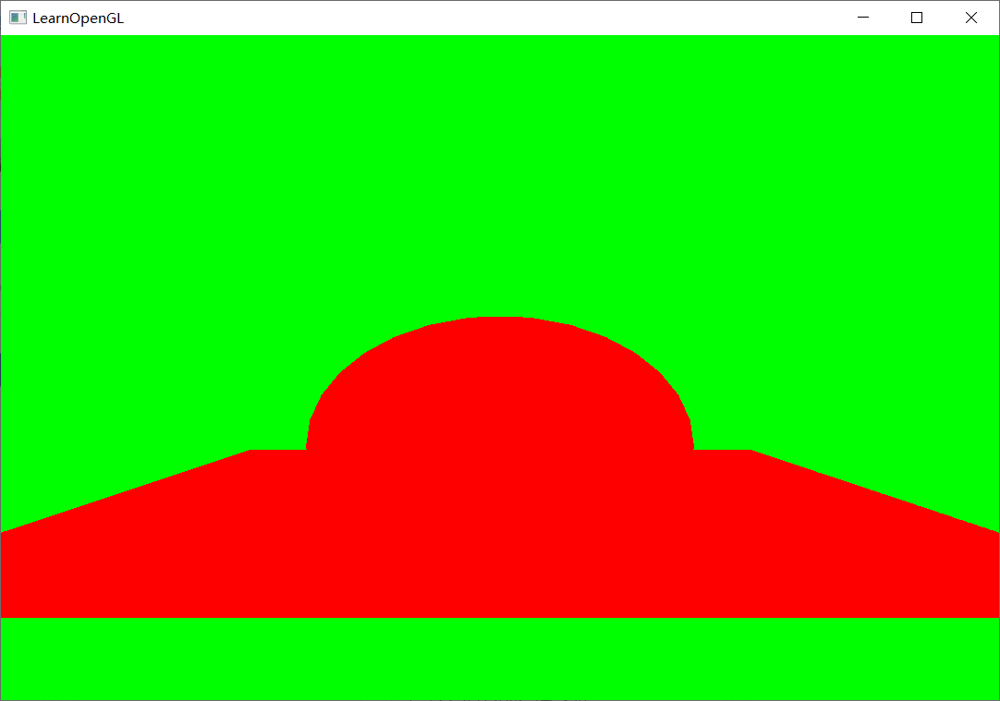

# 光追

1. forward 管线 √
2. test scene √
3. bvh √
4. raytracing 管线 √
5. disney pbr √
6. sobol sequence √
7. importance sample √
8. 可视化 √
9. 正确性验证 √
10. 其他加速结构 & 算法优化 √
11. imgui
12. 更多测试场景

中期答辩

1. 为什么UE和unity已经有了光追，还要做一遍 -- √
2. 数据的测量用的什么标准
3. 数据测量的数据指标不够
4. 应用在哪
5. 场景不够复杂

下一步

1. 封装 imGui
2. 更多数据
3. 写论文

## output

路径追踪

伽马矫正

Disney BRDF

4000 sp

SAH

BVH

## 参考

https://github.com/AKGWSB/EzRT?tab=readme-ov-file

重要性采样  https://zhuanlan.zhihu.com/p/360420413